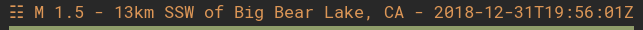
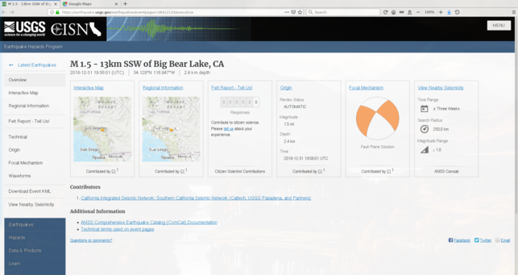
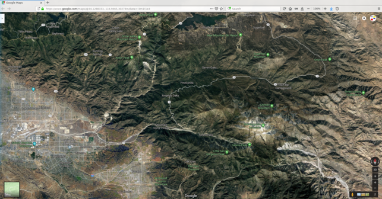

# Polybar Module - Earthquake

## Description
This [polybar](https://github.com/jaagr/polybar)  module shows magnitude, location and time of the latest seismic event on Earth.

For more information about which earthquakes are shown, see  [ComCat Documentation - Data Availability](https://earthquake.usgs.gov/data/comcat/data-availability.php).

## Screenshots

Output of this script



*Output of this script*



*USGS event page - [M 1.5 - 13km SSW of Big Bear Lake, CA](https://earthquake.usgs.gov/earthquakes/eventpage/ci38412120/executive)*



*Location of the seismic event on Google Maps*

## Installation
Clone or download this repository, then run the following commands:
```
$ cd polybar-module-earthquake
$ sh install.sh
```
Enable this module in your bar, e.g:
```
[bar/mybar]
...
modules-left = earthquake ...
```

Finally, restart polybar.

## License
This software is licensed under the MIT license. See [LICENSE](LICENSE.md)
